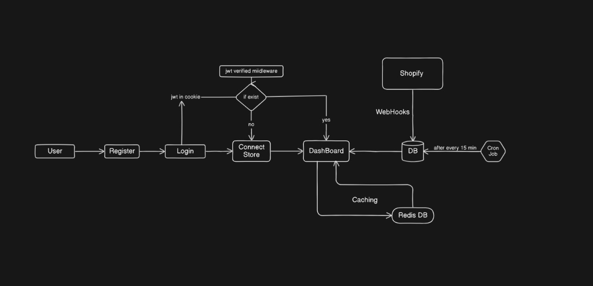

# Shopify Data Ingestion Service

## Deployed URL
https://shopify-backend-serviccee.onrender.com

---

## Tech Stack / Libraries Used

- **Backend Framework**: [Express.js](https://expressjs.com/) – lightweight Node.js web framework.  
- **ORM**: [Prisma](https://www.prisma.io/) – type-safe database access.  
- **Database**: [PostgreSQL](https://www.postgresql.org/) hosted on [Neon](https://neon.tech/) – serverless cloud Postgres.  
- **Caching Layer**: [Redis](https://redis.io/) via [Upstash Redis Cloud](https://upstash.com/) – low-latency caching of income queries.  
- **Hosting**: [Render](https://render.com/) – deployed backend service.  
- **Frontend (Charts)**: [Recharts](https://recharts.org/en-US/) with React – for data visualization.  
- **Cron Job**: External scheduler hitting the backend **every 15 minutes** to keep the Render free-tier dyno alive.  

---

## ⚙️ Installation

Clone the repository:
```bash
git clone https://github.com/Akkhil-1/Shopify-Backend-Service
```

Install Dependencies:
```bash
npm install
```

Run Command :
```bash
npm start
```

---

## API ENDPOINTS
Authentication Endpoints [ POST Request ]
```bash
Register        -> https://shopify-backend-serviccee.onrender.com/admin/register
Login           -> https://shopify-backend-serviccee.onrender.com/admin/login
ConnectStore    -> https://shopify-backend-serviccee.onrender.com/admin/register/tenants
Logout          -> https://shopify-backend-serviccee.onrender.com/admin/logout
```

Webhook Ingestion Endpoints [ POST Request ]
```bash
CreateOrder  -> https://shopify-backend-serviccee.onrender.com/webhooks/orders/create 
UpdateOrder  -> https://shopify-backend-serviccee.onrender.com/webhooks/orders/updated

CreateCustomer  -> https://shopify-backend-serviccee.onrender.com/webhooks/customers/create
UpdateCustomer  -> https://shopify-backend-serviccee.onrender.com/webhooks/customers/updated

CreateProducts  -> https://shopify-backend-serviccee.onrender.com/webhooks/products/create
UpdateProducts  -> https://shopify-backend-serviccee.onrender.com/webhooks/products/updated
```

Metrics & Data Analysis Endpoints [ GET Request ]
```bash
OverView         -> https://shopify-backend-serviccee.onrender.com/metrics/getOverview
Recent_Orders    -> https://shopify-backend-serviccee.onrender.com/metrics/getRecentOrders
Top_Customers    -> https://shopify-backend-serviccee.onrender.com/metrics/getTopCustomers
Financial_Staus  -> https://shopify-backend-serviccee.onrender.com/metrics/getFinancialStaus
Daily_Income     -> https://shopify-backend-serviccee.onrender.com/metrics/getDailyIncome
Monthly_Sale     -> https://shopify-backend-serviccee.onrender.com/metrics/monthlySale
```
---

## Visuals
### System Workflow Diagram


---
### Cronjob


---
### Redis CLI (Caching)


